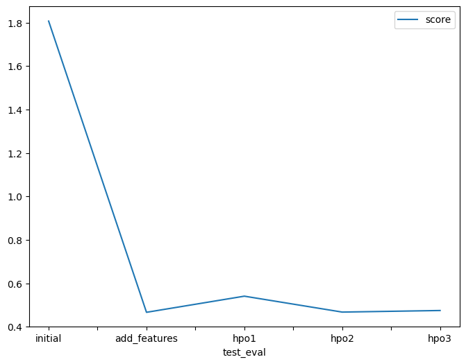

# Report: Predict Bike Sharing Demand with AutoGluon Solution
#### Aikorkem Izimova

## Initial Training
### What did you realize when you tried to submit your predictions? What changes were needed to the output of the predictor to submit your results?
When I first tried to submit predictions, I realized that AutoGluon produced continuous (float) values, but the count column represents the number of bike rentals, which should be non-negative integers. While the submission was accepted by Kaggle without rounding, I ensured that any negative predictions were clipped to zero to maintain logical correctness. I chose not to round the predictions to integers since the submission still worked, but ideally, rounding would improve interpretability and potentially the score.

### What was the top ranked model that performed?
After running AutoGluon with default settings, the top-performing model was WeightedEnsemble_L3, which achieved a validation RMSE of −53.12. This ensemble model combined predictions from earlier level-2 models and outperformed all individual learners.
Notably, level-1 models like CatBoost, LightGBM, and ExtraTrees performed significantly worse, with RMSEs above −124. This demonstrates how stacking boosted performance substantially.

## Exploratory data analysis and feature creation
### What did the exploratory analysis find and how did you add additional features?
Datetime:
    Data spans from 2011 to 2013 and is fairly uniformly distributed over time.

Categorical Features:
    season: Uniform distribution across all four seasons.
    holiday: Holidays are rare.
    workingday: Most data points fall on working days.
    weather: Majority of entries are for clear or misty/cloudy conditions; heavy weather is rare.

Numerical Features:
    temp and atemp: Roughly normal with peaks between 10–30°C. Almost perfectly correlated.
    humidity: Left-skewed, peaking at 40–90%. Some zeros may indicate missing data.
    windspeed: Right-skewed, with many low values (0–20 km/h).
    count: Strongly right-skewed. Most rentals are low; high rental days are rare.

Correlation Insights:
    count has strong positive correlations with registered (0.97) and casual (0.69).
    Moderate positive correlation with temp and atemp (0.39), though the latter two are nearly redundant.
    Moderate relationships exist between weather and humidity (0.41), and between datetime and season (0.48).

Behavioral Patterns (Barplots):
    Hour vs. Count: Clear rush-hour peaks (7–9 AM, 4–7 PM), typical of commuter behavior.
    Day of Week: Slight increase in demand from Thursday to Saturday; lowest on Sundays.
    Month: Seasonal trends, with warmer months (spring/summer) showing higher rentals.
    Year: 2012 shows increased demand over 2011.
    Weather: Clear weather yields highest rentals. Interestingly, heavy weather (category 4) shows higher average rentals than light adverse (category 3), likely due to sparse data in extreme conditions.

### How much better did your model preform after adding additional features and why do you think that is?
To better support modeling and simplify relationships, the following transformations were applied:
Datetime decomposition: Extracted year, month, dayofweek, and hour from the datetime column.
Categorical conversion: Converted season and weather to categorical types to reflect their nominal nature.
    Feature removal:
    Dropped atemp due to its high correlation with temp.
    Dropped casual and registered from training to avoid data leakage (they sum to count).
    These changes aimed to reduce redundancy, remove target leakage, and highlight informative temporal patterns.

Performance improvement:
After adding these features and preprocessing steps, the best model — the WeightedEnsemble_L3 — improved its validation RMSE from approximately -53.12 (initial run) to -30.42, a significant reduction in error. Among individual base models, LightGBM, Random Forest, and CatBoost all showed marked improvements, with LightGBM_BAG_L2 achieving an RMSE of -30.65, down from around -55.04 initially.

This substantial performance gain is likely due to:
    Enhanced temporal representation: By decomposing the datetime variable, the model could capture complex time-dependent patterns in bike rental demand, such as peak hours, weekday/weekend effects, and seasonal variations.
    Reduced multicollinearity and leakage: Removing highly correlated and target-leaking features improved the model’s generalization and prevented overfitting.
    Better handling of categorical variables: Treating season and weather as categorical variables allowed tree-based models to split on these discrete factors more effectively.
Overall, the additional feature engineering and careful preprocessing enabled the models to better understand underlying data structures and produce more accurate demand predictions.

## Hyper parameter tuning
### How much better did your model preform after trying different hyper parameters?
Although hyperparameter tuning is typically expected to enhance model performance, in this case, none of the tuned models outperformed the version trained with additional features. The RMSE dropped significantly from 53.12 (initial) to 30.42 after feature engineering, but subsequent HPO attempts resulted in higher RMSE values.

Model	RMSE
initial	53.12
add_features	30.42
hpo1	37.11
hpo2	33.34
hpo3	33.61

Initial model: Default features and parameters, serving as the baseline.
Add features: Incorporating engineered features led to the most significant performance gain, reducing RMSE by over 40%.
HPO1–HPO3: These runs involved hyperparameter tuning with various presets and model sets, but RMSE remained higher than the add_features model.

Why hyperparameter tuning underperformed:
The likely reason hyperparameter tuning did not surpass the add_features baseline is that the search space was too constrained—either due to limited ranges, insufficiently diverse model types, or short tuning time. Additionally, AutoGluon's default ensemble strategy is often already quite competitive; if the parameter space isn't meaningfully broader or deeper, further tuning may yield diminishing returns. This is especially true when the gain from feature engineering already captures most of the available signal in the data.

Conclusion:
In this case, feature quality had a greater impact than hyperparameter tuning. HPO may still be valuable, but to be effective, it likely needs a wider or more customized search space, longer training time, or additional model diversity.

### If you were given more time with this dataset, where do you think you would spend more time?
If given more time, I would focus on two key areas: improving the hyperparameter tuning process and expanding feature engineering efforts.
On the tuning side, I would begin by closely examining AutoGluon's default parameters, which I initially overlooked. My current approach started with a deterministic search using predefined values, without understanding the baseline configuration or adapting the search space dynamically. As a result, the tuning process may have been too constrained or misaligned with the model's strengths, leading to limited performance gains—none of the HPO experiments outperformed the add_features model in RMSE. In future iterations, I would adopt a more exploratory, data-driven tuning strategy, potentially using Bayesian optimization and allocating more time and resources to broader, more flexible search spaces.
Additionally, I would invest more time in feature engineering, which proved highly effective in earlier experiments. I would explore categorizing continuous variables, such as grouping temperature ranges into meaningful bands (e.g., cold, mild, hot), and creating aggregated weather categories to capture latent patterns. These types of domain-informed features could enrich the model's input space and improve performance more effectively than tuning alone.
Overall, a combination of well-informed hyperparameter tuning and richer feature engineering would be my main focus to further enhance the model.

### Create a table with the models you ran, the hyperparameters modified, and the kaggle score.

### Create a line plot showing the top model score for the three (or more) training runs during the project.

### Create a line plot showing the top kaggle score for the three (or more) prediction submissions during the project.

## Summary
This project demonstrated the effectiveness of AutoGluon in predicting bike sharing demand through a combination of exploratory data analysis, feature engineering, and modeling. Initial runs with default features and parameters provided a baseline RMSE of about 53.12. By decomposing the datetime variable and refining categorical features—while removing redundant and leakage-prone variables—the model achieved a substantial improvement, lowering RMSE to 30.42.
Attempts at hyperparameter tuning did not further reduce error beyond this level, likely due to constrained search spaces and the already competitive default ensemble strategy within AutoGluon. This highlights that careful feature engineering can yield greater performance gains than tuning alone in this context.
Given more time, expanding feature engineering (e.g., categorizing temperature and weather) and adopting more adaptive, exploratory hyperparameter optimization strategies would be promising directions. Overall, the project underlines the critical role of domain-aware feature design combined with automated machine learning frameworks in solving real-world regression problems effectively.
