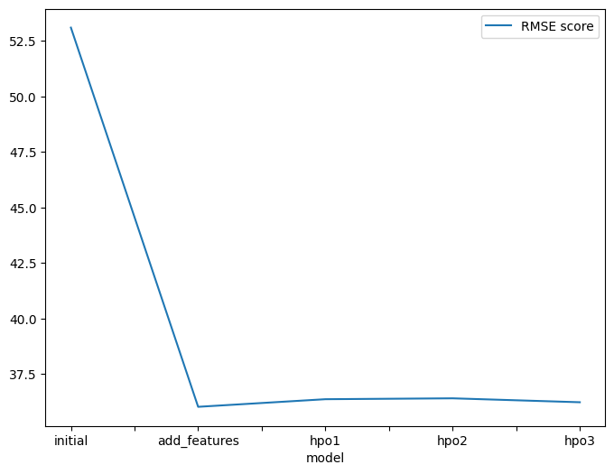

# Report: Predict Bike Sharing Demand with AutoGluon Solution
#### Aikorkem Izimova

## Initial Training
### What did you realize when you tried to submit your predictions? What changes were needed to the output of the predictor to submit your results?
When I first tried to submit predictions, I realized that AutoGluon produced continuous (float) values, but the count column represents the number of bike rentals, which should be non-negative integers. While the submission was accepted by Kaggle without rounding, I ensured that any negative predictions were clipped to zero to maintain logical correctness. I chose not to round the predictions to integers since the submission still worked, but ideally, rounding would improve interpretability and potentially the score.

### What was the top ranked model that performed?
After running AutoGluon with default settings, the top-performing model was WeightedEnsemble_L3, which achieved a validation RMSE of −53.11. This ensemble model combined predictions from earlier level-2 models and outperformed all individual learners.
Notably, level-1 models like CatBoost, LightGBM, and ExtraTrees performed significantly worse, with RMSEs above −124. This demonstrates how stacking boosted performance substantially.

## Exploratory data analysis and feature creation
### What did the exploratory analysis find and how did you add additional features?
Datetime:
    Data spans from 2011 to 2013 and is fairly uniformly distributed over time.

Categorical Features:
    season: Uniform distribution across all four seasons.
    holiday: Holidays are rare.
    workingday: Most data points fall on working days.
    weather: Majority of entries are for clear or misty/cloudy conditions; heavy weather is rare.

Numerical Features:
    temp and atemp: Roughly normal with peaks between 10–30°C. Almost perfectly correlated.
    humidity: Left-skewed, peaking at 40–90%. Some zeros may indicate missing data.
    windspeed: Right-skewed, with many low values (0–20 km/h).
    count: Strongly right-skewed. Most rentals are low; high rental days are rare.

Correlation Insights:
    count has strong positive correlations with registered (0.97) and casual (0.69).
    Moderate positive correlation with temp and atemp (0.39), though the latter two are nearly redundant.
    Moderate relationships exist between weather and humidity (0.41), and between datetime and season (0.48).

Behavioral Patterns (Barplots):
    Hour vs. Count: Clear rush-hour peaks (7–9 AM, 4–7 PM), typical of commuter behavior.
    Day of Week: Slight increase in demand from Thursday to Saturday; lowest on Sundays.
    Month: Seasonal trends, with warmer months (spring/summer) showing higher rentals.
    Year: 2012 shows increased demand over 2011.
    Weather: Clear weather yields highest rentals. Interestingly, heavy weather (category 4) shows higher average rentals than light adverse (category 3), likely due to sparse data in extreme conditions.

### How much better did your model preform after adding additional features and why do you think that is?
Adding new features and preprocessing steps significantly improved performance, reducing RMSE from 53.10 (initial) to 36.03. Key changes included:
Datetime decomposition into year, month, dayofweek, and hour to capture time-based patterns.
New features like temp_category and activity_level added behavioral insights.
One-hot encoding applied to categorical variables for better model compatibility.
Removed atemp, casual, and registered to avoid redundancy and target leakage.
These changes helped models capture peak usage times, seasonality, and categorical effects more effectively. Feature engineering contributed more to performance gains than hyperparameter tuning in this case.

## Hyper parameter tuning
### How much better did your model preform after trying different hyper parameters?
Hyperparameter tuning did not improve performance beyond the feature-engineered model. RMSE dropped from 53.10 to 36.03 after feature engineering, while all HPO attempts resulted in slightly higher RMSEs (36.23–36.41), even with increased time and best_quality mode.

Why?
Feature engineering captured most predictive signals. Without expanding the search space or model diversity, tuning had limited effect.

Model	RMSE
initial	53.103332
add_features	36.025632
hpo1	36.368298
hpo2	36.408183
hpo3	36.231506

### If you were given more time with this dataset, where do you think you would spend more time?
I would focus on improving hyperparameter tuning by exploring AutoGluon’s defaults, expanding the search space, and using smarter strategies like Bayesian optimization. I’d also deepen feature engineering, such as binning temperatures or aggregating weather types, since earlier feature work led to the largest performance gains.

### Create a table with the models you ran, the hyperparameters modified, and the kaggle score.

### Create a line plot showing the top model score for the three (or more) training runs during the project.

### Create a line plot showing the top kaggle score for the three (or more) prediction submissions during the project.

## Summary
AutoGluon effectively modeled bike-sharing demand, but the largest performance gains came from feature engineering, not tuning. Enhancing temporal and categorical features cut RMSE from ~53 to ~36. Hyperparameter tuning, limited by narrow search space and already strong defaults, failed to improve further.
Going forward, deeper feature transformations and a more flexible tuning strategy would likely yield greater benefits. This project highlights the outsized impact of informed feature design over parameter tweaking in automated ML workflows.
